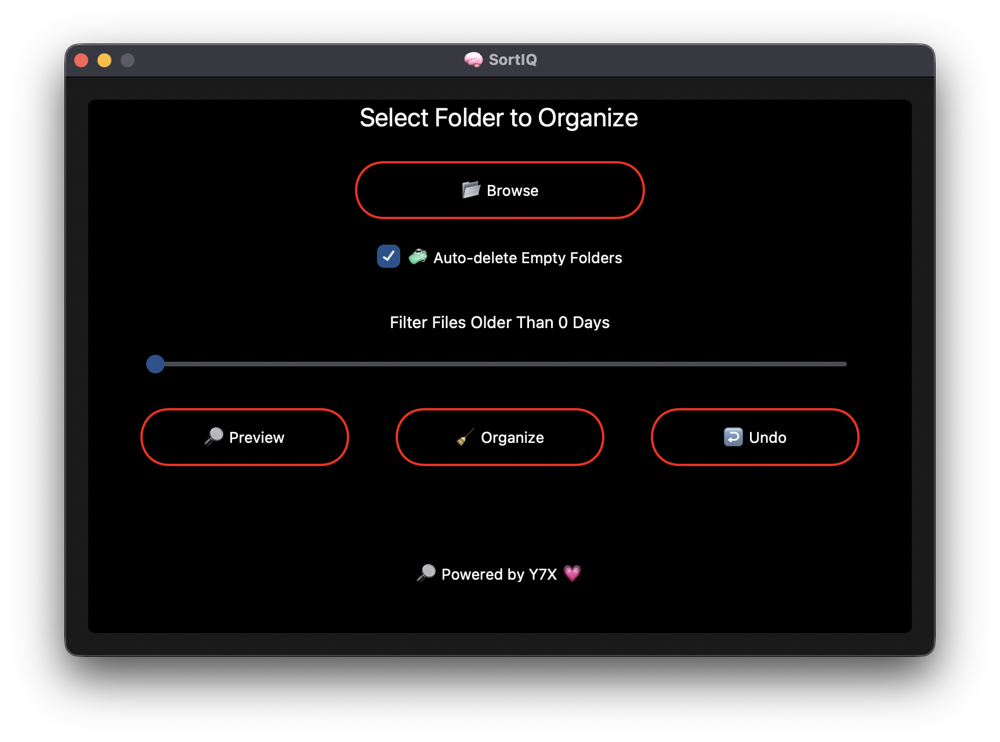

# 🧠 SortIQ

**Tidy up your messy folders with one click.**  
An intelligent, sleek file organizer with red-hot visuals and smart automation.

---

## 🚀 Features

- 📂 **One-Click Folder Organization**
- 🔍 **Preview before sorting**
- ↩️ **Undo any operation**
- 🧼 **Auto-delete Empty Folders**
- ⏳ **Filter files by Age (e.g., only older than 7 days)**
- 🧠 **Smart categorization based on file extensions**
- 🎨 **Sleek AMOLED UI with pitch-black background and red accents**
- 💾 **Remembers your last used folder and settings**

---

## 🖥️ Built With

- Python 3.x 🐍  
- `customtkinter` for modern GUI  
- Standard libraries: `os`, `shutil`, `pathlib`, `json`, `datetime`, `tkinter`
